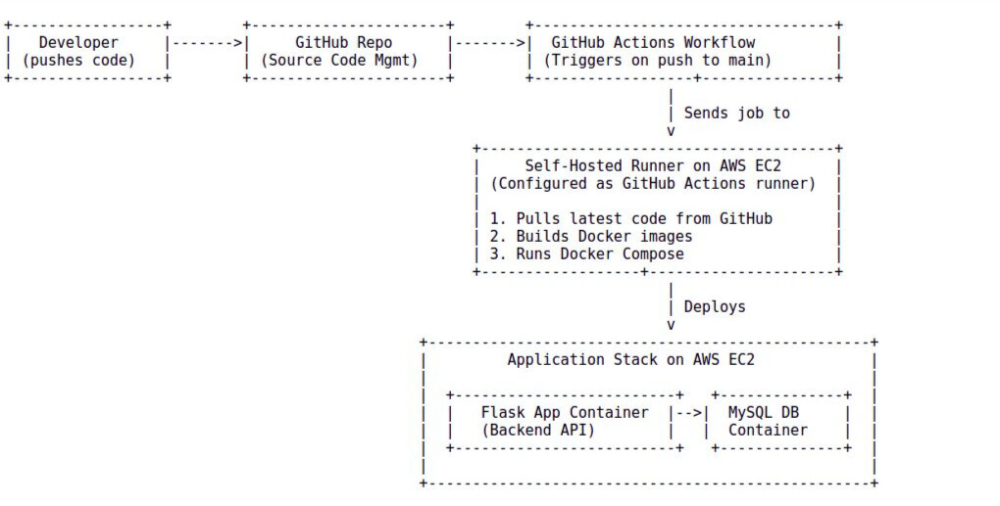
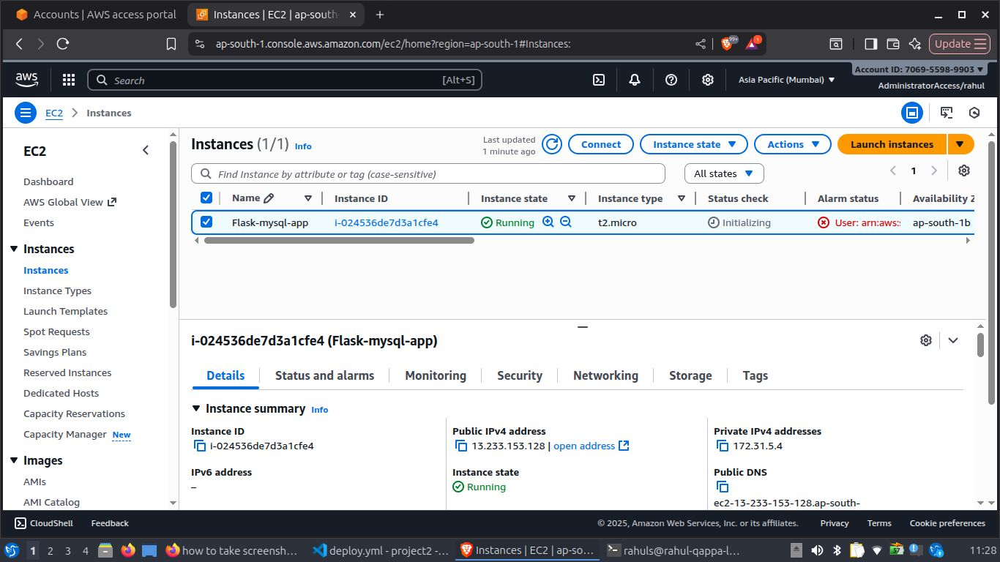
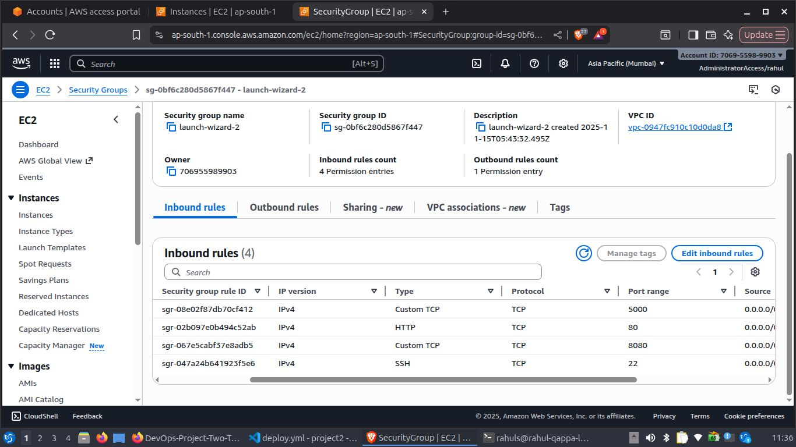
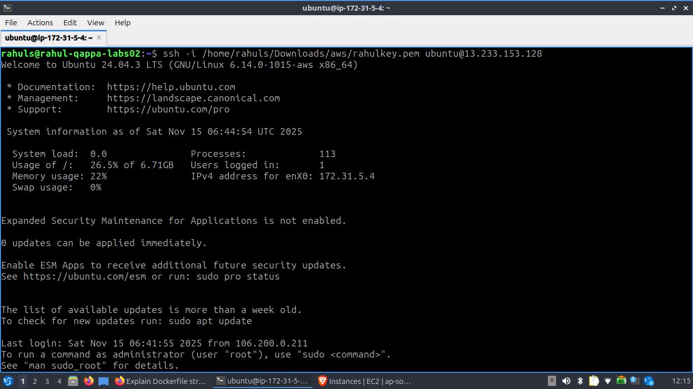
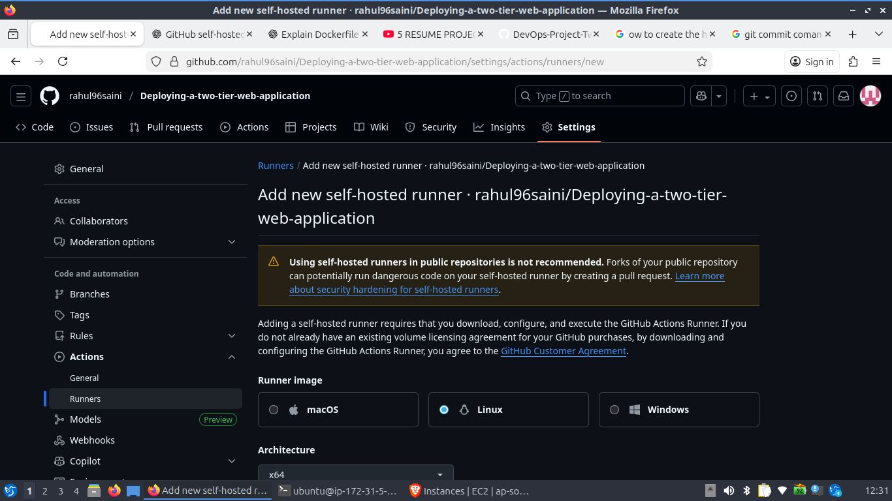
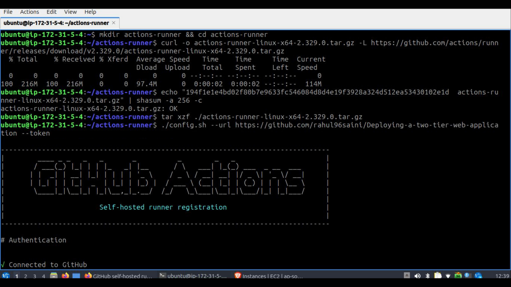
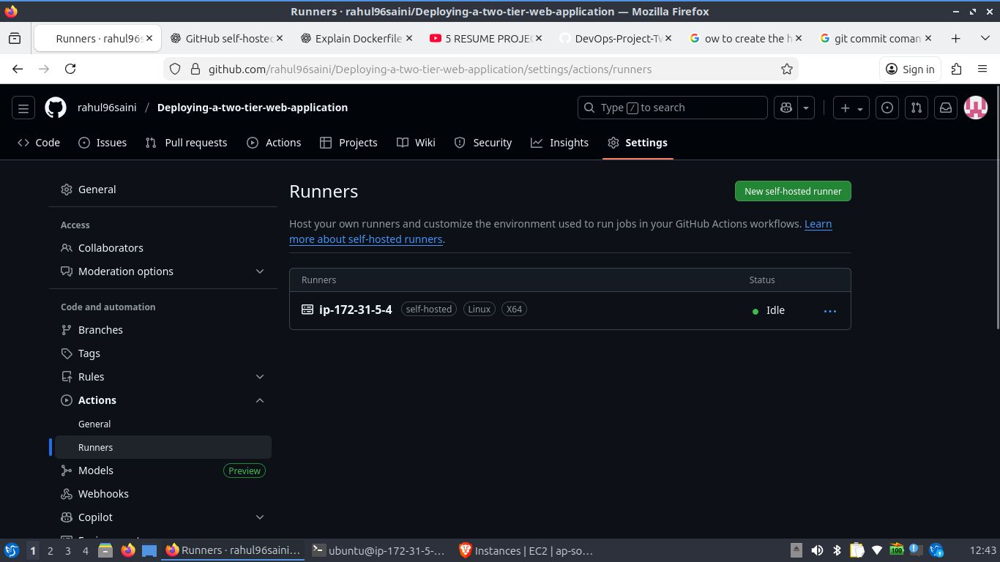
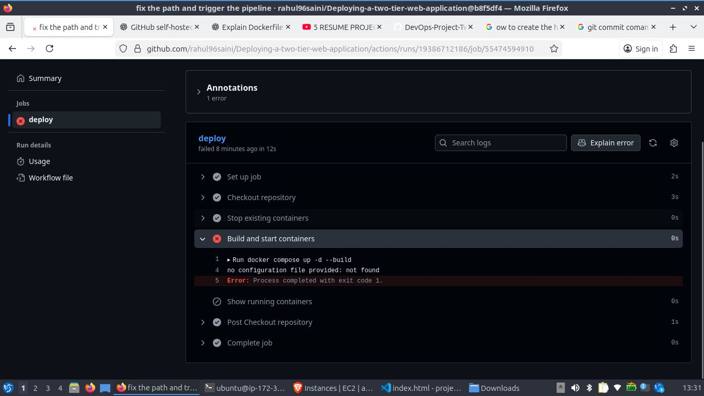
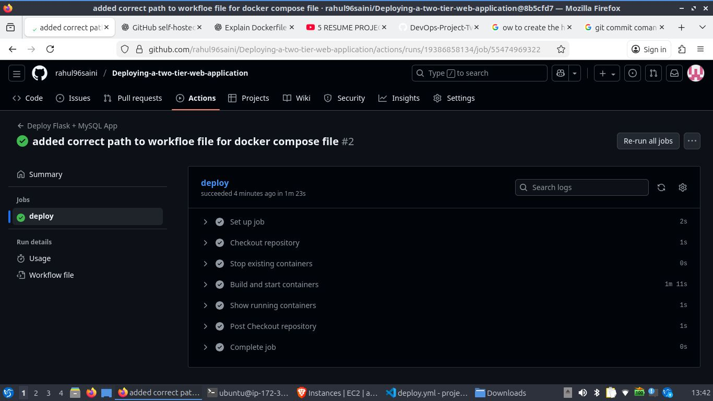

# Devops Project: Automated CI/CD pipeline with github actions for a 2-Tier flask application on AWS
# Author

[Rahul Saini](https://www.linkedin.com/in/rahul-saini-561aa71b5/)


# Table of Contents

1. [Project Overview](#Project-Overview)

2. [Architecture Diagram](#Architecture-Diagram)

3. [Step 1: AWS EC2 Instance Preparation](#Step-1:-AWS-EC2-Instance-Preparation)

4. [Step 2: Install Dependencies on EC2](#Step-2:-Install-Dependencies-on-EC2)

5. [Step 3: GitHub Actions – Self-Hosted Runner Setup](#Step-3:-GitHub-Actions–Self-Hosted-Runner-Setup)

6. [Step 4: GitHub Repository Configuration](#Step4:GitHub-Repository-Configuration)

    - [Dockerfile](#Dockerfile)

    - [Docker-compose file](#Docker-compose-file)

    - [GitHub Actions Workflow](#GitHub-Actions-Workflow-file)

7. [Step 5: GitHub Actions Pipeline Execution](#Step5:GitHubActionsPipelineExecution)

8. [Conclusion](#Conclusion)

9. [Infrastructure Diagram](#Infrastructure-Diagram)

10. [Workflow Diagram](#Workflow-Diagram)

# 1. Project Overview

This project shows how to set up a complete CI/CD pipeline to deploy a Flask + MySQL application on an AWS EC2 server using Docker and Docker Compose. The entire app runs in containers, and Docker Compose manages both the Flask and MySQL services together. The EC2 server is configured as a self-hosted GitHub Actions runner, which means GitHub can directly run deployment steps on it. 

Whenever developer push new code to the main branch, GitHub Actions automatically pulls the updated code, builds new Docker images, and redeploys the containers. This creates a fully automated and real-world DevOps workflow where updates are deployed quickly, consistently, and without manual steps.

# 2. Architecture Diagram



# 3. Step 1 :  Configure AWS EC2 Instance
1. Launch EC2 Instance:

    - Navigate to the AWS EC2 console.
    - Launch a new instance using the Ubuntu 22.04 LTS AMI.
    - Select the t2.micro instance type for free-tier eligibility.
    - Create and assign a new key pair for SSH access.



2. Configure Security Group:

    Create a security group with the following inbound rules:

    - Type: SSH, Protocol: TCP, Port: 22, Source: Your IP
    - Type: HTTP, Protocol: TCP, Port: 80, Source: Anywhere (0.0.0.0/0)
    - Type: Custom TCP, Protocol: TCP, Port: 5000 (for Flask), Source: Anywhere (0.0.0.0/0)



3. Connect to EC2 Instance:

    Use SSH to connect to the instance's public IP address.
    
`ssh -i /path/to/key.pem ubuntu@<ec2-public-ip>`



# 4. Step 2: Install Dependencies on EC2

1. Update System Packages:

    `sudo apt update && sudo apt upgrade -y`

2. Install Docker, and Docker Compose:

    `sudo apt install docker.io docker-compose -y`

3. Start and Enable Docker:

    `sudo systemctl start docker`

    `sudo systemctl enable docker`

4. Add User to Docker Group to run docker without sudo:
    `sudo usermod -aG docker $USER`

    `newgrp docker`

# 5. Step 3: GitHub Actions – Self-Hosted Runner Setup

To enable automated deployments through GitHub Actions, the EC2 instance is configured as a self-hosted runner. This allows GitHub to execute workflow jobs directly on the EC2 machine.



1. Navigate to Runner Settings
Open your GitHub repository and go to:

`Settings → Actions → Runners → New self-hosted runner`

Select Linux as the operating system and proceed to the installation section.

2. Download and Install the Runner on EC2
Execute the commands provided by GitHub on the EC2 instance.

- Create a folder

`mkdir actions-runner && cd actions-runner`

- Download the latest runner package

`curl -o actions-runner-linux-x64-2.329.0.tar.gz -L https://github.com/actions/runner/releases/download/v2.329.0/actions-runner-linux-x64-2.329.0.tar.gz`

- Optional: Validate the hash

`echo "194f1e1e4bd02f80b7e9633fc546084d8d4e19f3928a324d512ea53430102e1d  actions-runner-linux-x64-2.329.0.tar.gz" | shasum -a 256 -c`

- Extract the installer / package

`tar xzf ./actions-runner-linux-x64-2.329.0.tar.gz`

3. Configure the Runner

Run the configuration script to connect the EC2 instance with your GitHub repository:

`./config.sh --url https://github.com/rahul96saini/Deploying-a-two-tier-web-application --token for the runner`

4. Start the Runner
Once the configuration completes, start the runner service:

`./run.sh`



The terminal must remain open while the runner is active.

5. Referencing the Runner in GitHub Workflows

In the GitHub Actions workflow file, specify the runner type: `runs-on: self-hosted`

This ensures all workflow jobs run directly on the EC2 instance using the configured self-hosted runner.




# Step 4: GitHub Repository Configuration
In this step, you prepare your GitHub repository with all the required configuration files that enable containerization and automated deployment. This includes setting up the Dockerfile, docker-compose.yml, and the GitHub Actions workflow that will run on your self-hosted runner.

## Dockerfile
This file defines the environment for the Flask application container.

```
# Use an official lightweight Python 3.9 base image

FROM python:3.9-slim

# Set the working directory inside the container, all application files will be copied here

WORKDIR /app

# Install system dependencies required for mysqlclient / gcc, libmysqlclient-dev, and pkg-config are essential

RUN apt-get update && apt-get install -y gcc default-libmysqlclient-dev pkg-config && rm -rf /var/lib/apt/lists/*

# Copy dependencies file first to leverage Docker layer caching, This ensures image rebuilds are faster if only code changes

COPY requirements.txt .

# Install Python dependencies inside the container

RUN pip install --no-cache-dir -r requirements.txt

# Copy the entire project code into the container

COPY . .

# Expose port 5000 to allow external access to the Flask app

EXPOSE 5000

# Define the default command to run the Flask application

CMD ["python", "app.py"]
```
## docker-compose.yml

This file defines and orchestrates the multi-container application (Flask and MySQL).

```
version: "3.8"

services:
  mysql:
    image: mysql:8.0
    container_name: mysql_db_container
    environment:
      MYSQL_ROOT_PASSWORD: root
      MYSQL_DATABASE: mydatabase
    ports:
      - "3306:3306"
    volumes:
      - mysql_data:/var/lib/mysql
      - ./messages.sql:/docker-entrypoint-initdb.d/messages.sql
    networks:
      - two-tier-nt
    restart: always
    healthcheck:
      test: ["CMD", "mysqladmin", "ping", "-h", "localhost", "-uroot", "-proot"]
      interval: 10s
      timeout: 5s
      retries: 5
      start_period: 60s

  flask-app:
    container_name: flask_app_container
    build:
      context: .
    ports:
      - "5000:5000"
    environment:
      - MYSQL_HOST=mysql
      - MYSQL_USER=root
      - MYSQL_PASSWORD=root
      - MYSQL_DB=mydatabase
    networks:
      - two-tier-nt
    depends_on:
      mysql:
        condition: service_healthy
    healthcheck:
      test: ["CMD-SHELL", "curl -f http://localhost:5000/health || exit 1"]
      interval: 10s
      timeout: 5s
      retries: 5
      start_period: 60s

volumes:
  mysql_data:

networks:
  two-tier-nt:

```

## GitHub Actions Workflow File

This file contains the pipeline-as-code definition for github actions.

```
name: Deploy Flask + MySQL App

on:
  push:
    branches:
      - main    # Trigger workflow only when code is pushed to main branch

jobs:
  deploy:
    runs-on:  # Use your EC2 self-hosted GitHub Actions runner
      - self-hosted
      - linux
      - x64

    steps:
      - name: Checkout repository   # Pull latest code from GitHub repo into runner
        uses: actions/checkout@v3   

      - name: Stop existing containers    # Stop old containers; ignore error if none exist
        run: |
          docker compose down || true
        working-directory: ./flask-mysql-app

      - name: Build and start containers  # Build fresh images and start containers in detached mode
        run: |
          docker compose up -d --build
        working-directory: ./flask-mysql-app

      - name: Show running containers   # Show active containers
        run: docker ps
```

# Step 5: GitHub Actions Pipeline Execution
Once all configuration files are in place, the CI/CD workflow is fully automated. Whenever ``new changes are pushed to the main branch``, GitHub Actions immediately triggers the pipeline. The configured self-hosted runner on the EC2 instance receives the job and begins executing each stage of the workflow.

The runner pulls the latest code, rebuilds the Docker images, and redeploys the Flask and MySQL containers using Docker Compose. This ensures that every code update is consistently delivered and deployed without manual intervention.

After deployment, the application becomes accessible through the EC2 instance's public IP address on port 5000:

``http://<EC2-Public-IP>:5000``





# Infrastructure Diagram


